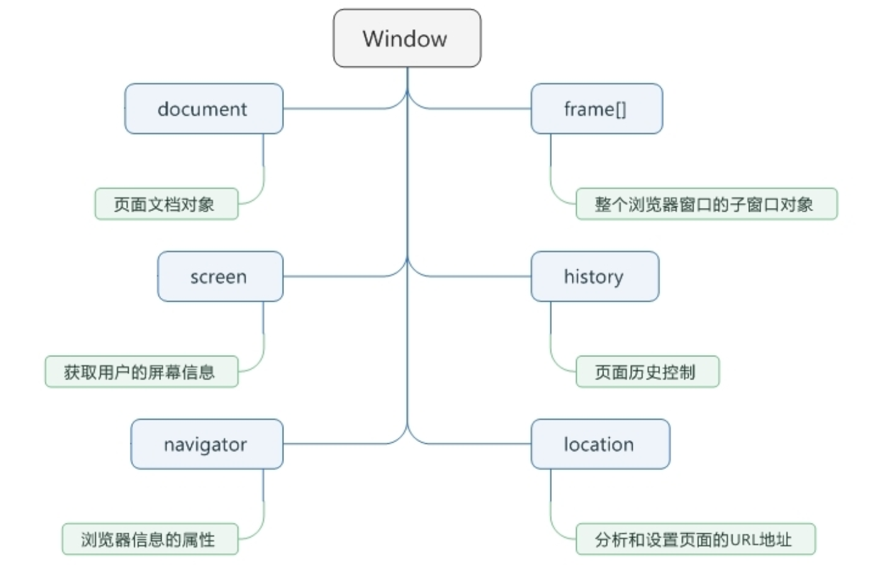

# BOM

BOM 即浏览器对象模型。

BOM提供了独立于内容 而与浏览器窗口进行交互的对象；

由于BOM主要用于管理窗口与窗口之间的通讯，因此其核心对象是window。

结构示例图：



## Window 对象

主要用来对浏览器窗口控制；window对象是一个全局对象，不需要特殊的语法，就可以对窗口的属性进行控制，比如：可以直接使用document.方法()而不必使用window.document.方法()来调用。

#### Window 对象属性

属性                      描述

closed              返回窗口是否已被关闭

defaultStatus	    设置或返回窗口状态栏中的默认文本。

document	        对 Document 对象的只读引用。

history	            对 History 对象的只读引用。

innerheight	        返回窗口的文档显示区的高度。

innerwidth	        返回窗口的文档显示区的宽度。

length	            设置或返回窗口中的框架数量。

location	        用于窗口或框架的 Location 对象。

name	            设置或返回窗口的名称。

Navigator	        对 Navigator 对象的只读引用

opener	            返回对创建此窗口的窗口的引用。

outerHeight	        返回窗口的外部高度。

outerWidth	        返回窗口的外部宽度。

pageXOffset	        设置或返回当前页面相对于窗口显示区左上角的 X 位置。

pageYOffset	        设置或返回当前页面相对于窗口显示区左上角的 Y 位置。

parent	            返回父窗口。

Screen	            对 Screen 对象的只读引用

self	            返回对当前窗口的引用。等价于 Window 属性。

status	            设置窗口状态栏的文本。

top	                返回最顶层的先辈窗口。

screenLeft screenTop screenX screenY	只读整数。声明了窗口的左上角在屏幕上的的 x 坐标和 y 坐标。IE、Safari 和 Opera 支持 screenLeft 和 screenTop，而 Firefox 和 Safari 支持 screenX 和 screenY。

#### Window 对象方法

方法                      描述

alert()         显示带有一段消息和一个确认按钮的警告框。

blur()	        把键盘焦点从顶层窗口移开。

clearInterval()	取消由 setInterval() 设置的 timeout。

clearTimeout()	取消由 setTimeout() 方法设置的 timeout。

close()	        关闭浏览器窗口。

confirm()	    显示带有一段消息以及确认按钮和取消按钮的对话框。

createPopup()	创建一个 pop-up 窗口。

focus()	        把键盘焦点给予一个窗口。

moveBy()	    可相对窗口的当前坐标把它移动指定的像素。

moveTo()	    把窗口的左上角移动到一个指定的坐标。

open()	        打开一个新的浏览器窗口或查找一个已命名的窗口。

print()	        打印当前窗口的内容。

prompt()	    显示可提示用户输入的对话框。

resizeBy()	    按照指定的像素调整窗口的大小。

resizeTo()	    把窗口的大小调整到指定的宽度和高度。

scrollBy()	    按照指定的像素值来滚动内容。

scrollTo()	    把内容滚动到指定的坐标。

setInterval()	按照指定的周期（以毫秒计）来调用函数或计算表达式。

setTimeout()	在指定的毫秒数后调用函数或计算表达式。


## Location 对象

location对象是window对象和document对象的属性，用来分析和设置页面的URL地址。

#### Location 对象属性

属性	                    描述

hash	        设置或返回从井号 (#) 开始的 URL（锚）。

host	        设置或返回主机名和当前 URL 的端口号。

hostname	    设置或返回当前 URL 的主机名。

href	        设置或返回完整的 URL。

pathname	    设置或返回当前 URL 的路径部分。

port	        设置或返回当前 URL 的端口号。

protocol	    设置或返回当前 URL 的协议。

search	        设置或返回从问号 (?) 开始的 URL（查询部分）。

#### Location 对象方法

方法              描述

assign()	加载新的文档。

reload()	重新加载当前文档。

replace()	用新的文档替换当前文档。

## Screen 对象

Screen 对象包含有关客户端显示屏幕的信息；主要用来获取用户的屏幕信息，并作出优化

#### Screen 对象属性

属性                      描述

availHeight	        返回显示屏幕的高度 (除 Windows 任务栏之外)。

availWidth	        返回显示屏幕的宽度 (除 Windows 任务栏之外)。

bufferDepth	        设置或返回调色板的比特深度。

colorDepth	        返回目标设备或缓冲器上的调色板的比特深度。

deviceXDPI	        返回显示屏幕的每英寸水平点数。

deviceYDPI	        返回显示屏幕的每英寸垂直点数。

fontSmoothingEnabled	返回用户是否在显示控制面板中启用了字体平滑。

logicalXDPI	        返回显示屏幕每英寸的水平方向的常规点数。

logicalYDPI	        返回显示屏幕每英寸的垂直方向的常规点数。

pixelDepth	        返回显示屏幕的颜色分辨率（比特每像素）。

updateInterval	    设置或返回屏幕的刷新率。

width	            返回显示器屏幕的宽度。

height	            返回显示屏幕的高度。

代码示例：

```
document.write("总宽度/高度: ");
document.write(screen.width + "*" + screen.height);
document.write("<br>");
document.write("可以宽度/高度: ");
document.write(screen.availWidth + "*" + screen.availHeight);
document.write("<br>");
document.write("颜色深度: ");
document.write(screen.colorDepth);
document.write("<br>");
document.write("颜色分辨率: ");
document.write(screen.pixelDepth);
```

## History 对象

History 对象包含用户（在浏览器窗口中）访问过的 URL

主要实现前进后退等功能

#### History 对象属性

属性          描述

length	返回历史列表中的网址数

#### History 对象方法

方法              描述

back()	    加载 history 列表中的前一个 URL

forward()	加载 history 列表中的下一个 URL

go()	    加载 history 列表中的某个具体页面


## Navigator 对象

获取浏览器、操作系统信息

#### Navigator 对象属性

属性                  描述

appCodeName	    返回浏览器的代码名。

appMinorVersion	返回浏览器的次级版本。

appName	        返回浏览器的名称。

appVersion	    返回浏览器的平台和版本信息。

browserLanguage	返回当前浏览器的语言。

cookieEnabled	返回指明浏览器中是否启用 cookie 的布尔值。

cpuClass	    返回浏览器系统的 CPU 等级。

onLine	        返回指明系统是否处于脱机模式的布尔值。

platform	    返回运行浏览器的操作系统平台。

systemLanguage	返回 OS 使用的默认语言。

userAgent	    返回由客户机发送服务器的 user-agent 头部的值。

userLanguage	返回 OS 的自然语言设置。

#### Navigator 对象方法

方法                  描述

javaEnabled()	规定浏览器是否启用 Java。

taintEnabled()	规定浏览器是否启用数据污点。

示例代码：

```
txt = "<p>浏览器代号: " + navigator.appCodeName + "</p>";
txt+= "<p>浏览器名称: " + navigator.appName + "</p>";
txt+= "<p>浏览器版本: " + navigator.appVersion + "</p>";
txt+= "<p>启用Cookies: " + navigator.cookieEnabled + "</p>";
txt+= "<p>硬件平台: " + navigator.platform + "</p>";
txt+= "<p>用户代理: " + navigator.userAgent + "</p>";
txt+= "<p>用户代理语言: " + navigator.systemLanguage + "</p>";
```