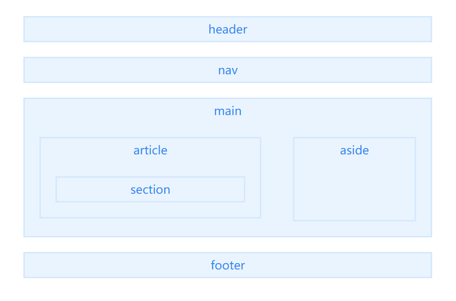

# html语义化

> 当页面样式加载失败的时候能够让页面呈现出清晰的结构;

> 有利于seo优化，利于被搜索引擎收录（更便于搜索引擎的爬虫程序来识别;

> 方便其他设备解析，如盲人阅读器根据语义渲染网页;

> 便于项目的开发及维护，使html代码更具有可读性，便于其他设备解析。


## 注意点

1、尽可能少的使用无语义的标签div和span；

2、在语义不明显时，既可以使用div或者p时，尽量用p标签,因为p标签在默认情况下有上下间距，对兼容特殊终端有利；

3、不要使用纯样式标签，如：b、font、u等，改用css设置。

4、需要强调的文本，可以包含在strong或者em标签中（浏览器预设样式，能用CSS指定就不用他们），strong默认样式是加粗（不要用b），em是斜体（不用i）；

5、使用表格时，标题要用caption，表头用thead，主体部分用tbody包围，尾部用tfoot包围。表头和一般单元格要区分开，表头用th，单元格用td；

6、表单域要用fieldset标签包起来，并用legend标签说明表单的用途；

7、每个input标签对应的说明文本都需要使用label标签，并且通过为input设置id属性，在lable标签中设置for=someld来让说明文本和相对应的input关联起来。

## 主体结构标签



#### header

定义文档或者文档的部分区域的页眉，应作为介绍内容或者导航链接栏的容器

通常包含h1-h6元素或hgroup，作为整个页面或者一个内容块的标题。也可以包裹一节的目录部分，一个搜索框，一个nav，或者任何相关logo。

整个页面没有限制header元素的个数，可以拥有多个，可以为每个内容块增加一个header元素。但需要注意的是header元素不能作为address、footer 或 header 元素的子元素。

#### hgroup

hgroup元素代表“网页”或“section”的标题，当元素有多个层级时，该元素可以将h1到h6元素放在其内，譬如文章的主标题和副标题的组合。

```
<hgroup>
    <h1>这是一篇介绍HTML 5语义化标签和更简洁的结构</h1>
    <h2>HTML 5</h2>
</hgroup>
```

注意点：

1、如果只需要一个h1-h6标签就不用hgroup

2、如果有连续多个h1-h6标签就用hgroup

3、如果有连续多个标题和其他文章数据，h1-h6标签就用hgroup包住，和其他文章元数据一起放入header标签


#### nav

描述一个含有多个超链接的区域，该区域包含跳转到其他页面或页面内部其他部分的链接列表。

nav只能用在页面主要导航部分上。页脚区域中的链接列表，虽然指向不同网站的不同区域，譬如服务条款，版权页等，这些footer元素就能够用了。

在一个文档中，可定义多个 nav 元素。

#### main

定义文档的主要内容，该内容在文档中应当是独一无二的，不包含任何在文档中重复的内容，比如侧边栏，导航栏链接，版权信息，网站logo，搜索框（除非搜索框作为文档的主要功能）。

需要注意的是在一个文档中不能出现多个 main 标签

#### section

section元素代表文档中的“节”或“段”，“段”可以是指一篇文章里按照主题的分段；“节”可以是指一个页面里的分组。

section通常还带标题，虽然html5中section会自动给标题h1-h6降级，但是最好手动给他们降级。

>使用注意点：

一张页面可以用section划分为简介、文章条目和联系信息。不过在文章内页，最好用article。section不是一般意义上的容器元素，如果想作为样式展示和脚本的便利，可以用div。表示文档中的节或者段；article、nav、aside可以理解为特殊的section，所以如果可以用article、nav、aside就不要用section，没实际意义的就用div

#### article

表示文档、页面、应用或网站中的独立结构，是可独立分配的、可复用的结构，如在发布中，它可能是论坛帖子、杂志或新闻文章、博客、用户提交的评论、交互式组件，或者其他独立的内容项目，其目的是为了让开发者独立开发或重用。

除了它的内容，article 会有一个标题（通常会在header里），会有一个footer页脚。

```
<article>
    <h1>一篇文章</h1>
    <p>文章内容..</p>
    <footer>
        <p>表示文档、页面、应用或网站中的独立结构</p>
    </footer>
</article>

```


>如果在article内部再嵌套article，那就代表内嵌的article是与它外部的内容有关联的，如博客文章下面的评论；article内部嵌套article，有可能是评论或其他跟文章有关联的内容。

```
<article>

    <header>
        <h1>一篇文章</h1>
        <p><time pubdate datetime="2012-10-03">2012/10/03</time></p>
    </header>

    <p>文章内容..</p>

    <article>
        <h2>评论</h2>

        <article>
            <header>
                <h3>评论者: XXX</h3>
                <p><time pubdate datetime="2012-10-03T19:10-08:00">~1 hour ago</time></p>
            </header>
            <p>哈哈哈</p>
        </article>

        <article>
            <header>
                <h3>评论者: XXX</h3>
                <p><time pubdate datetime="2012-10-03T19:10-08:00">~1 hour ago</time></p>
            </header>
            <p>哈？哈？哈？</p>
        </article>

    </article>

</article>
```

>文章里的章节，一个article里嵌套section

因为文章内section部分虽然也是独立的部分，但是它门只能算是组成整体的一部分，从属关系，article是大主体，section是构成这个大主体的一部分。本网站的全部文章都是article嵌套一个个section章节，这样能让浏览器更容易区分各个章节所包括的内容。

```
<article>

    <h1>前端技术</h1>
    <p>前端技术有那些</p>

    <section>
        <h2>CSS</h2>
        <p>样式..</p>
    </section>

    <section>
        <h2>JS</h2>
        <p>脚本</p>
    </section>

</article>
```

> 一个section里嵌套article

比如：UI设计师、前端工程师、后端工程师等等都是一个独立的整体，他们组成了网站制作基本配备。UI设计师、前端工程师、后端工程师就像article，是一个个独立的整体，而section将这些自成一体的article包裹，就组成了一个小团体。

```
<section>

    <h1>介绍: 网站制作成员配备</h1>

    <article>
        <h2>设计师</h2>
        <p>设计网页的...</p>
    </article>

    <article>
        <h2>程序员</h2>
        <p>后台写程序的..</p>
    </article>

    <article>
        <h2>前端工程师</h2>
        <p>给楼上两位打杂的..</p>
    </article>

</section>
```

#### aside

aside元素被包含在article元素中作为主要内容的附属信息部分，其中的内容可以是与当前文章有关的相关资料、标签、名次解释等。（特殊的section）

在article元素之外使用作为页面或站点全局的附属信息部分，可以表示一个和其余页面内容几乎无关的部分，被认为是独立于该内容的一部分且可以被单独的拆分出来而不会影响整体。最典型的是侧边栏，其中的内容可以是日志串连，其他组的导航，甚至广告，这些内容相关的页面。

```
<article>
    <p>内容</p>
    <aside>
        <h1>aside</h1>
        <p>被认为是独立于该内容的一部分且可以被单独的拆分出来而不会影响整体</p>
    </aside>
</article>

```

#### footer

footer元素代表“网页”或“section”的页脚，通常含有该节的一些基本信息，譬如：作者，相关文档链接，版权资料。如果footer元素包含了整个节，那么它们就代表附录，索引，提拔，许可协议，标签，类别等一些其他类似信息。

注意点：

1、可以是“网页”或任意“section”的底部部分；

2、没有个数限制，除了包裹的内容不一样，其他跟header类似。

## 库和框架

### 库

库是封装好的特定方法的集合，提供给开发者使用，库没有控制权，控制权在使用者手上；比如：jQuery、util

### 框架

是一套架构，会基于自身的特点向用户提供一套相当完整的解决方案，而且控制权在框架本身，使用者要找框架所规定的某种规范进行开发；比如：Vue、react、angular


